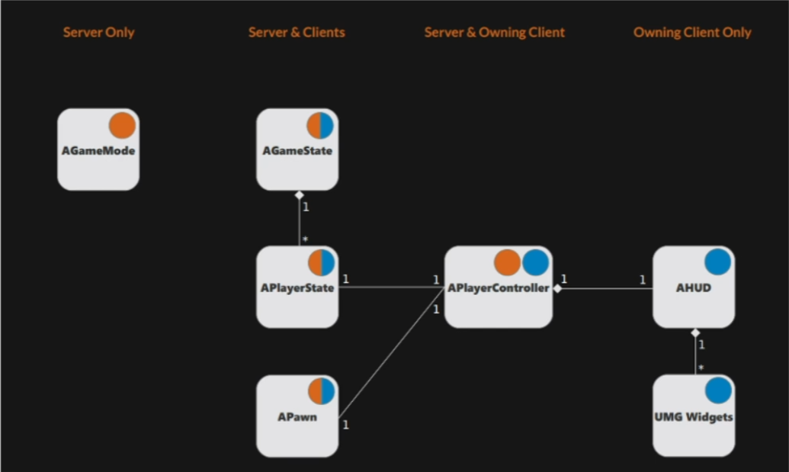

# Lesson 01
Here are the most important classes of an Unreal Project and how they relate to each other. Orange stuff is server-only, blue stuff is client-only, dots with both colors are hybrid.

- `AGameMode`: score, setup of the game, parameters that control how you enter a win/lose state. Being server-only, it's safe from outside manipulation.
- `AGameState`: play mode? pause? end or start of the level?
- `APlayerState`: am I stunned? Can I move? Am I invincible?

In Tantrum we'll overlook the game state and player state because the core game loop of our game is very small and simple. Following a structure just for the sake of it doesn't really provide any extra benefit.

In a server authoritative model, it's always the server only stuff that communicates down to the other classes. You can't query the game mode from the controller or the pawn.